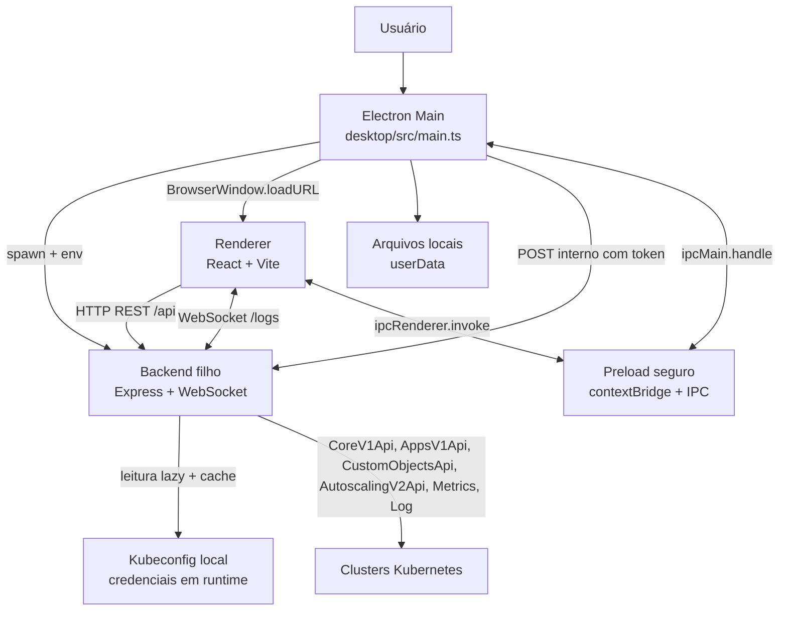
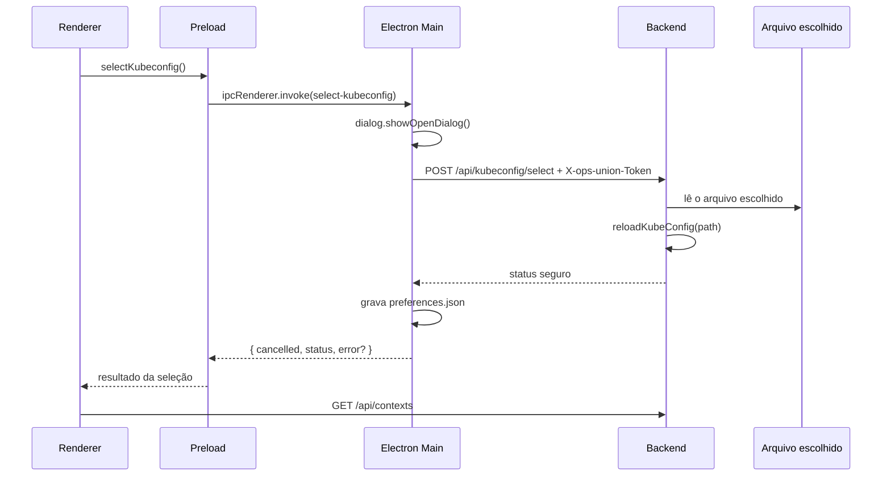

# ops-union - Definicao tecnica do Electron

> Documento de referência da arquitetura e do comportamento de comunicação do
> ops-union. O checkout atual inclui a implementacao da especificacao v1.5.2;
> isso nao representa uma release publicada.

## 1. Objetivo e escopo

O ops-union é um aplicativo local, desktop e estritamente read-only para
inspeção de pods Kubernetes em vários contextos e namespaces.

A unidade de consulta do produto é o par:

```text
(contexto do kubeconfig, namespace)
```

O sistema permite:

- descobrir contextos do kubeconfig;
- descobrir namespaces disponíveis nos contextos selecionados;
- consultar pods em paralelo em vários alvos;
- agregar os resultados em uma tabela única;
- abrir detalhes, eventos e métricas de um pod;
- acompanhar logs de um container por WebSocket;
- atualizar a lista de pods manualmente ou por polling configuravel;
- persistir presets e o caminho do kubeconfig localmente.

O sistema não permite alterar o Kubernetes. Não existem operações de create,
update, patch, replace, delete, restart, scale, exec, attach ou port-forward.

## 2. Resumo executivo

No modo desktop, existem três camadas em processos distintos:

1. **Electron Main**: gerencia a janela, o ciclo de vida, o diálogo nativo de
  seleção de arquivo, o IPC e o processo filho do backend.
2. **Backend Node.js**: abre um servidor HTTP/WebSocket somente em localhost,
  serve o frontend compilado e é o único componente que acessa o Kubernetes.
3. **Renderer React**: executa dentro da `BrowserWindow`, apresenta a interface
  e chama o backend por `fetch` e WebSocket. Não tem acesso direto a Node.js ou
  ao filesystem.



### 2.1 Regra fundamental de comunicação

O Electron **não consulta o Kubernetes diretamente**.

O caminho sempre é:

```text
Renderer React
  -> HTTP ou WebSocket local
  -> Backend Node.js
  -> @kubernetes/client-node
  -> API do cluster Kubernetes
```

As exceções são as funções de desktop que realmente precisam do processo Main:

```text
Renderer
  -> preload/contextBridge
  -> IPC Electron
  -> Main
```

Essas funções são a seleção nativa do kubeconfig e a persistência de presets.

## 3. Componentes e responsabilidades

### 3.1 Processo Electron Main

Entrada compilada: [desktop/src/main.ts](../desktop/src/main.ts)

Responsabilidades:

- impedir duas instancias simultaneas com `requestSingleInstanceLock()`;
- escolher uma porta TCP local disponível;
- ler o caminho de kubeconfig salvo nas preferências;
- gerar um token interno aleatório para a rota de seleção de kubeconfig;
- iniciar e parar o backend como processo filho;
- aguardar o health check do backend antes de criar a janela;
- criar a `BrowserWindow` com isolamento de contexto e sandbox;
- carregar o frontend pela URL local do backend;
- responder aos handlers IPC;
- abrir o diálogo nativo de seleção de kubeconfig;
- salvar `preferences.json` e `presets.json` no diretório `userData`;
- encerrar o backend quando a janela ou o processo desktop for encerrado.

Configuração de segurança da janela:

| Opcao | Valor | Efeito |
| --- | --- | --- |
| `contextIsolation` | `true` | Isola o código da página do contexto privilegiado |
| `nodeIntegration` | `false` | O renderer não pode importar Node diretamente |
| `sandbox` | `true` | Restringe capacidades do renderer |
| `preload` | `desktop/dist/preload.js` | Expõe somente a ponte declarada |
| abertura de janela | negada | Links não criam novas janelas Electron |

### 3.2 Preload

Entrada: [desktop/src/preload.ts](../desktop/src/preload.ts)

O preload expõe apenas `window.opsFlowDesktop`:

```typescript
{
  isDesktop: true,
  platform: process.platform,
  selectKubeconfig(),
  loadPresets(),
  savePresets(presets)
}
```

Não existe API genérica de IPC, acesso a filesystem, execução de comando ou
acesso a credenciais no renderer.

### 3.3 Backend

Entradas:

- [backend/src/index.ts](../backend/src/index.ts): servidor HTTP e WebSocket;
- [backend/src/app.ts](../backend/src/app.ts): Express, rotas e frontend estático;
- [backend/src/config.ts](../backend/src/config.ts): host, porta e variáveis locais;
- [backend/src/logsWebSocket.ts](../backend/src/logsWebSocket.ts): upgrade e ciclo
  de vida do stream de logs.

O backend:

- escuta somente em `127.0.0.1`;
- usa a porta `OPS_FLOW_PORT`, ou `4000` fora do desktop;
- usa o mesmo servidor HTTP para o WebSocket;
- serve `frontend/dist` quando `OPS_FLOW_FRONTEND_DIST` está definido;
- não possui banco de dados;
- não guarda credenciais em respostas ou logs;
- chama somente APIs de leitura do Kubernetes.

### 3.4 Renderer

Entradas principais:

- [frontend/src/main.tsx](../frontend/src/main.tsx): montagem do React;
- [frontend/src/App.tsx](../frontend/src/App.tsx): shell, health check e refresh;
- [frontend/src/api.ts](../frontend/src/api.ts): cliente REST e construtor de URL
  WebSocket;
- [frontend/src/store.ts](../frontend/src/store.ts): estado global Zustand;
- [frontend/src/components/TargetSelector.tsx](../frontend/src/components/TargetSelector.tsx):
  contextos, namespaces, alvos e presets;
- [frontend/src/components/PodDetailsPanel.tsx](../frontend/src/components/PodDetailsPanel.tsx):
  describe, métricas e logs;
- [frontend/src/components/LogViewer.tsx](../frontend/src/components/LogViewer.tsx):
  consumo do stream de logs.

O renderer conhece somente os contratos normalizados. Ele não recebe o objeto
bruto do kubeconfig nem conhece token, certificado ou chave.

## 4. Ciclo de vida do desktop

### 4.1 Inicialização passo a passo

1. O Electron adquire o lock de instância única.
2. `app.whenReady()` chama `createMainWindow()`.
3. O Main resolve o diretório raiz:
  - desenvolvimento: diretório do repositório;
   - empacotado: `process.resourcesPath`.
4. O Main define o diretório do frontend compilado.
5. `availablePort()` reserva temporariamente uma porta em `127.0.0.1:0`,
   descobre o número e libera a sonda.
6. O Main gera `internalToken` com 32 bytes aleatórios em hexadecimal.
7. `startBackend()` inicia `backend/dist/index.js` usando `process.execPath`.
8. O Main injeta no processo filho:

   ```text
   ELECTRON_RUN_AS_NODE=1
   OPS_FLOW_PORT=<porta escolhida>
  OPS_FLOW_FRONTEND_DIST=<diretório frontend>
  OPS_FLOW_INTERNAL_TOKEN=<token efêmero>
   OPS_FLOW_SELECTED_KUBECONFIG=<caminho salvo, quando houver>
   ```

9. `waitForBackend()` faz `GET /api/health` a cada 100 ms, por no máximo
   10 segundos.
10. Quando o health check responde HTTP 2xx, o Main cria a `BrowserWindow`.
11. A janela carrega `http://127.0.0.1:<porta>`.
12. O Express entrega `frontend/index.html` e os assets compilados.
13. O React monta e inicia seus efeitos de carregamento.

Se o backend não responder em 10 segundos, a janela não é criada; o Main fecha
o processo filho, mostra um erro nativo e encerra o Electron.

### 4.2 Encerramento

Ao fechar a janela:

1. o evento `close` é interceptado;
2. `shutdownApplication()` evita reentrada;
3. o Main envia `kill()` ao processo backend;
4. aguarda o evento de saída do filho;
5. destrói a janela e encerra o Electron.

`SIGINT` e `SIGTERM` seguem o mesmo fluxo. O WebSocket de logs também é
interrompido quando o processo backend termina.

### 4.3 Desenvolvimento web versus Electron

| Aspecto | Desenvolvimento web | Desktop empacotado ou `dev:desktop` |
| --- | --- | --- |
| Frontend | Vite em `http://localhost:5173` | Servido pelo Express local |
| Backend | Processo iniciado em separado, normalmente `:4000` | Filho do Electron em porta dinâmica |
| Origem do renderer | Vite | `http://127.0.0.1:<porta>` |
| `/api` | Proxy Vite para `127.0.0.1:4000` | Mesma origem do backend |
| WebSocket | Proxy Vite com `ws: true` | Mesmo servidor HTTP do backend |
| Preload | Ausente no navegador | Injeta `window.opsFlowDesktop` |
| Presets | `localStorage` | `presets.json`, com fallback localStorage |
| Frontend estático | Não servido pelo backend | Express serve `frontend/dist` |

Configuração do proxy de desenvolvimento: [frontend/vite.config.ts](../frontend/vite.config.ts).

## 5. Canais de comunicação

Existem cinco tipos de comunicação no MVP:

1. Main Electron -> processo backend: `spawn` e variáveis de ambiente.
2. Renderer -> backend: HTTP REST local.
3. Renderer <-> backend: WebSocket local para logs.
4. Renderer <-> Main: IPC restrito via preload.
5. Backend -> Kubernetes: HTTPS usando o kubeconfig e as credenciais do usuário.

Também há dois acessos auxiliares:

- Main -> backend: health check e seleção interna de kubeconfig;
- frontend -> Google Fonts: os links de fonte presentes no `index.html` podem
  acessar `fonts.googleapis.com` e `fonts.gstatic.com`.

Não há telemetria, analytics ou chamada para um serviço de negócio externo.

## 6. API HTTP exposta pelo backend

Base em desktop:

```text
http://127.0.0.1:<porta-dinamica>
```

Base no backend standalone:

```text
http://127.0.0.1:${OPS_FLOW_PORT:-4000}
```

O servidor fica acessível para qualquer processo local que consiga acessar esse
loopback. Não existe autenticação de usuário ou multiusuário.

### 6.1 Tabela de endpoints

| Método | Rota | Chamador | Quando | Frequência |
| --- | --- | --- | --- | --- |
| `GET` | `/api/health` | Main e App | inicialização do backend e verificação visual | Main: polling de 100 ms até pronto; App: uma vez por montagem |
| `GET` | `/api/kubeconfig/status` | store | montar o seletor de alvos | uma vez por montagem lógica |
| `GET` | `/api/contexts` | store | carregar, recarregar ou após selecionar arquivo | montagem, botão Reload, retry ou após seleção |
| `POST` | `/api/kubeconfig/select` | Main | confirmar arquivo no diálogo nativo | somente ao selecionar arquivo |
| `POST` | `/api/namespaces` | store | mudar o conjunto de contextos selecionados | uma vez por conjunto novo de contextos |
| `POST` | `/api/pods` | store | Fetch pods, retry ou refresh automático | manual ou a cada 10, 30 ou 60 s |
| `GET` | `/api/pods/:cluster/:namespace/:pod/describe` | painel de detalhes | abrir outro pod | uma vez por pod aberto |
| `GET` | `/api/pods/:cluster/:namespace/:pod/metrics` | painel de detalhes | abrir outro pod | uma vez por pod aberto |

Os segmentos `cluster`, `namespace` e `pod` são codificados com
`encodeURIComponent` no frontend.

### 6.2 `GET /api/health`

Resposta normal:

```json
{
  "status": "ok",
  "service": "ops-union-backend",
  "readOnly": true
}
```

Essa rota não consulta Kubernetes. Ela apenas confirma que o processo backend
está ouvindo.

### 6.3 `GET /api/kubeconfig/status`

Resposta possível:

```json
{
  "available": true,
  "source": "environment",
  "contextCount": 2
}
```

`source` pode ser:

- `environment`: `KUBECONFIG` foi usado;
- `selected`: o arquivo foi selecionado pelo usuário ou veio de
  `OPS_FLOW_SELECTED_KUBECONFIG`;
- `default`: caminho padrão, normalmente `~/.kube/config`.

Em erro, o endpoint omite `contextCount` e retorna somente metadados seguros:

```json
{
  "available": false,
  "source": "default"
}
```

O caminho real do arquivo nunca é retornado.

### 6.4 `GET /api/contexts`

Consulta `KubeConfig.getContexts()` e retorna somente nomes e metadados públicos:

```json
{
  "contexts": [
    {
      "name": "cluster-a",
      "cluster": "cluster-example",
      "namespace": "default"
    }
  ]
}
```

Token, certificado, chave, URL privada e demais campos de autenticação do
kubeconfig não entram na resposta.

### 6.5 `POST /api/namespaces`

Request:

```json
{
  "clusters": ["cluster-a", "cluster-b"]
}
```

Resposta:

```json
{
  "namespaces": [
    {
      "name": "namespace-a",
      "clusters": ["cluster-b", "cluster-a"]
    }
  ],
  "errors": []
}
```

Embora seja `POST`, a operação é somente de leitura. O uso de `POST` existe
para transportar uma lista de contextos no corpo.

Internamente:

1. valida e normaliza a lista;
2. remove contextos duplicados;
3. executa `listNamespace()` em paralelo, um por contexto;
4. agrupa namespaces de mesmo nome;
5. anota em quais contextos cada namespace existe;
6. preserva falhas por contexto em `errors`.

### 6.6 `POST /api/pods`

Request:

```json
{
  "targets": [
    { "cluster": "cluster-a", "namespace": "namespace-a" },
    { "cluster": "cluster-b", "namespace": "namespace-a" }
  ]
}
```

Resposta agregada:

```json
{
  "pods": [
    {
      "cluster": "cluster-a",
      "namespace": "namespace-a",
      "name": "pod-app-7c8d6f9c6b-x2abc",
      "status": "Running",
      "ready": "2/2",
      "restarts": 0,
      "node": "node-1",
      "ageSeconds": 3600,
      "containers": ["app", "istio-proxy"]
    }
  ],
  "errors": []
}
```

Internamente:

1. valida cada par `cluster` + `namespace`;
2. inicia `listNamespacedPod({ namespace })` para todos os alvos em paralelo;
3. espera com `Promise.allSettled()`;
4. normaliza cada pod;
5. preserva o contexto e namespace de origem em cada item;
6. retorna pods bem-sucedidos e erros por alvo.

Uma falha de cluster não cancela os demais alvos.

### 6.7 `GET .../describe`

Rota:

```text
GET /api/pods/:cluster/:namespace/:pod/describe
```

Para um pod, o backend faz:

1. `readNamespacedPod({ name, namespace })`;
2. `listNamespacedEvent({ namespace, fieldSelector: "involvedObject.name=<pod>" })`;
3. normalização de status, node, IP, QoS, service account, data de criação,
  labels, annotations, conditions e containers, incluindo estado atual, ultimo
  estado e metadados de terminacao quando fornecidos;
4. resolução do owner chain para Deployment, StatefulSet ou Rollout, incluindo
  ReplicaSet -> Deployment/Rollout;
5. leitura best-effort do workload e listagem de HPAs namespaced, associando
  `spec.scaleTargetRef.kind/name`, inclusive `kind: Rollout`;
6. normalização de replicas, limites/current/desired do HPA e metricas de
  recursos, sem inventar campos ausentes;
7. ordenação dos eventos do mais novo para o mais antigo.

O describe tambem inclui `terminationHistory`, uma linha do tempo normalizada
com estados terminados atuais/anteriores dos containers e eventos do pod,
ordenada do mais novo para o mais antigo. Entradas sem timestamp ficam depois
das entradas datadas. Essa linha do tempo representa somente os dados presentes
no objeto atual do pod e nos eventos retornados pela consulta; nao e um historico
duravel de varios dias.

Se a leitura de eventos falhar por falta de permissão, o describe principal
continua e a resposta inclui `eventsError`.

O campo opcional `workload` preserva a identidade mesmo quando a leitura do
recurso ou do HPA falha. A interface mostra `HPA not configured` quando o
workload foi resolvido sem HPA e exibe notas não bloqueantes para falhas,
ausência da CRD de Argo Rollouts ou permissões insuficientes.

Status HTTP tratado pela rota:

- `400`: parâmetros ausentes;
- `403`: permissão negada no cluster;
- `404`: pod inexistente;
- `502`: outro erro upstream do Kubernetes.

### 6.8 `GET .../metrics`

Rota:

```text
GET /api/pods/:cluster/:namespace/:pod/metrics
```

O backend chama `metrics.getPodMetrics(namespace)`, encontra o pod pelo nome e
retorna uso por container:

```json
{
  "available": true,
  "window": "30s",
  "timestamp": "2026-09-15T12:00:00Z",
  "containers": [
    { "name": "app", "cpu": "25m", "memory": "64Mi" }
  ]
}
```

Ausência do `metrics-server`, recurso ainda não disponível ou erro conhecido da
API de métricas não vira falha HTTP. Vira:

```json
{
  "available": false,
  "reason": "This cluster does not expose the metrics API (metrics-server missing)."
}
```

Assim, describe e logs continuam utilizáveis sem metrics-server.

### 6.9 Servir o frontend

Quando `OPS_FLOW_FRONTEND_DIST` está definido, o backend:

- serve os assets estáticos;
- responde `index.html` para rotas que não começam com `/api/`;
- não trata uma rota `/api/*` desconhecida como página SPA.

Esse é o caminho usado pelo desktop empacotado.

## 7. WebSocket de logs

### 7.1 Abertura

Rota:

```text
WS /api/pods/:cluster/:namespace/:pod/logs?container=app&follow=true&tailLines=500
```

O frontend usa:

- `ws://` quando a página usa HTTP;
- `wss://` quando a página usa HTTPS.

No desktop atual a página usa HTTP local, portanto a URL efetiva é `ws://`.

Parâmetros:

| Parâmetro | Obrigatório | Padrão | Limite |
| --- | --- | --- | --- |
| `container` | sim | nenhum | nome do container |
| `follow` | não | `true` | `false` encerra após o backlog |
| `tailLines` | não | `500` | máximo `5000` |

O backend aceita upgrade somente no caminho exato. Outro upgrade recebe `404` e
o socket é destruído.

### 7.2 Mensagens servidor -> renderer

Inicio:

```json
{ "type": "started", "container": "app" }
```

Cada linha:

```json
{ "type": "line", "line": "2026-09-15 request completed" }
```

Erro:

```json
{ "type": "error", "message": "mensagem sanitizada" }
```

Fim:

```json
{ "type": "end" }
```

### 7.3 Ciclo de vida do stream

1. Ao abrir o painel de detalhes, a aba inicial é `Describe`; o WebSocket só é
  criado quando a aba `Logs` é montada.
2. O renderer abre um socket para o primeiro container do pod.
3. Ao trocar de container, o socket anterior é fechado e um novo é criado.
4. Ao fechar ou trocar de pod, o efeito React fecha o socket.
5. O backend recebe `close` ou `error`, aborta a requisição de logs no cluster e
   libera o stream.
6. Com `follow=true`, o socket permanece aberto enquanto o container produzir
   logs.
7. Erro de leitura envia `error` e encerra a conexão.
8. Com `follow=false`, `end` é enviado e a conexão é fechada.

Configurações do viewer:

- recebe inicialmente até 500 linhas;
- mantém no máximo 5.000 linhas no frontend;
- pausar interrompe o append local, mas mantém o socket aberto;
- linhas recebidas durante a pausa são descartadas;
- não existe reconexão automática;
- filtro e o auto-scroll comum são operações locais; a ação `Jump to latest` pode solicitar uma
  janela de cauda History quando necessário.

### 7.4 Sessao agregada e modo History

O workspace atual tambem usa `WS /api/logs` para a sessao agregada. Esse transporte mantem o
conjunto exato de fontes confirmado pelo Search e nao abre um socket por pod, fonte ou janela.

- **Live:** preserva a assinatura agregada, o follow, a retencao limitada no cliente e os filtros
  locais existentes.
- **History:** o Search aplicado envia `history.start` com intervalo e fontes. O backend faz uma
  unica leitura finita `follow=false` por fonte, grava um snapshot NDJSON temporario com indice de
  linha/offset/timestamp e responde com progresso, estados por fonte, limites e janelas
  `history.window`.
- O Search permanece habilitado quando o workspace esta ocioso. Com valores pendentes, confirma o
  rascunho; com valores iguais, repete explicitamente a operacao. A repeticao Live substitui a
  sessao agregada e resolve faixas relativas no momento da ativacao; a repeticao History cria uma
  nova geracao. Ativacoes duplicadas sao bloqueadas enquanto a operacao esta ocupada, sem impedir
  edicoes no rascunho.
- Depois de qualquer Search aceito, em Live ou History, incluindo confirmacoes somente de filtros,
  o viewer agenda uma unica chamada a acao existente `Jump to latest` quando os resultados iniciais
  ficam prontos. Em Live, aguarda linhas renderizadas; em History, aguarda a query inicial e
  preserva as cargas independentes de janelas e da cauda. A acao respeita Pause e nao altera o
  comportamento pausado.
- Uma janela carrega `sessionId`, `snapshotId`, `generation`, fonte, cursores e indicacao de mais
  dados. Geracoes, cursores, tamanho de frame e taxa de requisicoes sao validados; respostas de
  geracao obsoleta sao rejeitadas ou ignoradas.
- History significa tudo que a leitura finita entregar ate EOF, falha, cancelamento ou limite. Um
  limite ou falha produz estado parcial, nunca uma alegacao de paginacao nativa do Kubernetes.
- A transicao no fim historico e explicita: a sessao finita e fechada e uma nova sessao Live
  agregada e iniciada. Nao ha reread implicito, e logs `--previous` nao fazem parte da solicitacao
  padrao.

Os limites atuais incluem 100.000 linhas/32 MiB por fonte, 1.000.000 linhas/256 MiB por sessao,
48 MiB de disco por fonte, 384 MiB de disco por sessao, 4 MiB de memoria decodificada em voo por
fonte e 32 MiB por sessao, 256 KiB por registro, 2.000 registros ou 256 KiB por janela, 512 KiB
por frame, duas sessoes ativas, oito leituras concorrentes, 120 janelas por minuto, TTL terminal de
15 minutos e grace period de orfaos de uma hora. Esses limites sao fail-closed; os registros ja
capturados continuam sujeitos ao estado parcial ou ao motivo do limite.

Os estados visiveis incluem preparacao, leitura, pronto, parcial, falha, cancelamento e expiracao,
alem dos estados por fonte `queued`, `reading`, `indexing`, `ready`, `partial`, `failed` e
`cancelled`. A validacao da versao 1.3.2 registrada inclui 193 testes automatizados, sendo 88 no
backend e 105 no frontend. Os typechecks do backend e frontend, o build do frontend, os
diagnosticos e `git diff --check` tambem passaram. Os testes incluem o fechamento do workspace em
consultas explicitas, a preservacao no auto-refresh silencioso e o default de `Wrap lines`.

A validacao de integracao da versao 1.3.2 foi somente leitura: fan-out de pods, falha parcial,
describe, metricas, evento `started` do WebSocket agregado e health `readOnly: true` foram
exercitados nos contextos QA disponiveis, sem chamadas mutantes. A validacao headless cobriu a
launchpad em desktop, mobile e escala 2x, sem overflow horizontal visivel. A interacao de
navegador/Electron para reset, auto-refresh, retry, presets, transporte obsoleto e linhas longas
agrupadas nao foi concluida porque o alvo CDP ficou obsoleto; nao ha ferramenta de screen reader
disponivel. Rotacao/reinicio, falha de retry de limpeza, limpeza apos restart do desktop e
profiling de RSS permanecem sem verificacao. A identidade do cluster possui algumas permissoes
capazes de mutacao, portanto a protecao read-only continua sendo aplicada pela aplicacao. Os
limites de memoria decodificada em voo, de 4 MiB por fonte e 32 MiB por sessao, foram testados;
nao sao uma medicao de RSS.

## 8. Chamadas IPC do Electron

### 8.1 Handlers registrados no Main

Em [desktop/src/main.ts](../desktop/src/main.ts), existem exatamente três handlers:

| Canal | Renderer chama | Main faz | Momento |
| --- | --- | --- | --- |
| `select-kubeconfig` | `window.opsFlowDesktop.selectKubeconfig()` | abre diálogo, chama rota interna e salva preferência | clique no botão de selecionar arquivo |
| `load-presets` | `window.opsFlowDesktop.loadPresets()` | lê e valida `presets.json` | hidratação inicial do frontend |
| `save-presets` | `window.opsFlowDesktop.savePresets(presets)` | valida e grava `presets.json` | criar, editar ou apagar preset |

O renderer não envia token para a rota de seleção. O token fica somente no Main.

### 8.2 Seleção de kubeconfig

Fluxo completo:



Detalhes de erro:

- cancelamento no diálogo não altera o estado;
- token ausente ou incorreto recebe `404 Not found`;
- arquivo inválido recebe `400` e não substitui a configuração anterior;
- se o backend aceitar o arquivo, mas a preferência não puder ser gravada, o
  resultado volta com `status` e `error` para indicar que a sessão funciona,
  mas a escolha não foi persistida.

### 8.3 Presets

No desktop, `loadPersistentPresets()` usa IPC e o arquivo:

```text
<app.getPath('userData')>/presets.json
```

O arquivo contém apenas:

```json
[
  {
    "id": "...",
    "name": "Example preset",
    "description": "...",
    "targets": [
      { "cluster": "cluster-a", "namespace": "namespace-a" }
    ]
  }
]
```

Ao salvar, o frontend primeiro tenta `localStorage` e, se estiver no desktop,
também dispara `save-presets` sem bloquear a interface. O carregamento inicial
do desktop prefere `presets.json`; se falhar, cai para `localStorage`.

Na web, sem preload, somente `localStorage` é usado com a chave
`ops-union.presets.v1`.

### 8.4 Arquivos locais do Main

| Arquivo | Conteúdo | Leitura | Escrita |
| --- | --- | --- | --- |
| `preferences.json` | caminho selecionado do kubeconfig | inicialização | após seleção bem-sucedida |
| `presets.json` | ids, nomes, descrições e pares cluster/namespace | hidratação | cada alteração de preset |

O caminho de `userData` é definido pelo Electron, normalmente:

- Linux: `~/.config/ops-union/`;
- Windows: `%APPDATA%/ops-union/`;
- macOS: `~/Library/Application Support/ops-union/`.

Credenciais, tokens, certificados e conteúdo do kubeconfig não são persistidos
por esses mecanismos.

## 9. Fluxos de tela, gatilhos e frequências

### 9.1 Entrada da tela

Ao montar a interface, as ações lógicas são:

1. `hydratePresets()` carrega presets persistidos;
2. `loadContexts()` faz `GET /api/contexts`;
3. `loadKubeconfigStatus()` faz `GET /api/kubeconfig/status`;
4. o App faz `GET /api/health` para o indicador visual.

Essas chamadas podem ocorrer em paralelo.

Como [frontend/src/main.tsx](../frontend/src/main.tsx) usa `StrictMode`, efeitos de
montagem podem ser executados duas vezes pelo React em desenvolvimento. Isso
pode duplicar chamadas iniciais observadas no DevTools; não representa um
polling de produção e não altera a frequência do auto-refresh.

### 9.2 Seleção de contextos

Ao selecionar ou remover um contexto:

1. o estado local de namespaces selecionados é limpo;
2. o campo de namespace é limpo;
3. `NamespaceInput` detecta a nova chave de contextos;
4. o store faz `POST /api/namespaces`;
5. a resposta preenche o autocomplete.

O store ordena a lista para comparar conjuntos e evita nova chamada quando o
mesmo conjunto já foi carregado sem erro.

### 9.3 Adicao de alvos

Depois que o usuário seleciona namespaces válidos, o frontend cria um alvo para
cada combinação disponível:

```text
cada contexto selecionado x cada namespace selecionado
```

Pares duplicados são ignorados. Adicionar ou remover alvos não consulta pods
automaticamente. A consulta só ocorre no botão `Fetch pods` ou no timer de
auto-refresh.

### 9.4 Consulta manual de pods

Gatilhos:

- clique em `Fetch pods`;
- clique em `Refresh now`;
- retry após erro.

Efeito:

1. envia um único `POST /api/pods` contendo todos os alvos atuais;
2. backend consulta todos os alvos em paralelo;
3. frontend substitui a tabela pelo resultado agregado;
4. erros individuais aparecem no banner de alvo;
5. `lastUpdatedAt` recebe o horário local de conclusão.

O frontend usa ids de requisição, revisão de configuração e assinatura dos
alvos para ignorar respostas antigas que chegarem depois de uma nova seleção.
As requisições HTTP antigas não são abortadas no browser, mas suas respostas
não conseguem sobrescrever o estado atual.

Ao iniciar uma consulta explicita de pods, incluindo `Fetch pods`, `Refresh now`, retry ou
aplicacao de preset, o renderer fecha o workspace de logs e limpa fontes, selecoes, modal,
detalhes, selecao de linha e filtro da tabela antes de apresentar o novo resultado. Isso desmonta
o `LogViewer` e preserva a limpeza do transporte agregado. O auto-refresh silencioso usa o caminho
`refreshing` e preserva workspace, detalhes, filtro e estado de apresentacao.

### 9.5 Auto-refresh de pods

Opções disponíveis:

| Valor | Comportamento |
| --- | --- |
| `manual` / `0` | desativado |
| `10s` | um `POST /api/pods` a cada 10 segundos |
| `30s` | um `POST /api/pods` a cada 30 segundos |
| `60s` | um `POST /api/pods` a cada 60 segundos |

O timer existe somente quando há pelo menos um alvo. A atualização automática
usa `silent: true`: preserva a tabela visível e mostra apenas o estado de
refresh. O timer é desmontado ao mudar o intervalo, remover todos os alvos ou
desmontar o componente.

O intervalo de 10 segundos em `ViewToolbar` para atualizar o texto relativo
`"12s ago"` é somente local. Ele não faz nenhuma chamada de rede.

### 9.6 Abertura do painel de detalhes

Ao clicar em uma linha da tabela:

1. o frontend guarda `{ cluster, namespace, name, containers }`;
2. abre o painel lateral;
3. dispara em paralelo:
   - `GET .../describe`;
   - `GET .../metrics`;
4. espera os dois resultados com `Promise.allSettled()`;
5. mostra cada erro na sua aba, sem impedir a outra.

Isso ocorre uma vez para cada pod aberto. Trocar de aba entre Describe e Metrics
não repete as chamadas. O filtro, agrupamento e redimensionamento são locais.

### 9.7 Abertura da aba Logs

Ao montar a aba Logs, o renderer mantem as fontes confirmadas e abre o WebSocket agregado
`/api/logs`. Depois do Search aplicado:

1. Live envia uma assinatura agregada e acrescenta eventos ao buffer limitado.
2. History envia `history.start`, acompanha progresso/estado e solicita janelas limitadas ao redor
  da faixa virtualizada.
3. Trocar o modo, intervalo ou fontes pelo Search substitui a sessao anterior; repetir o Search sem
  mudancas tambem cria uma nova sessao Live ou geracao History.
4. Ao chegar ao fim History, a acao explicita de transicao fecha History e inicia uma nova sessao
  Live agregada.

Cada nova montagem do workspace inicia com `Wrap lines` habilitado. O controle altera somente a
apresentacao da sessao atual; nao persiste a escolha, reinicia o transporte nem altera agrupamento,
Search, filtros ou estado Live/History.

O endpoint legado por pod continua disponivel para compatibilidade. Pausar, limpar, filtrar,
agrupar e alterar auto-scroll permanecem operacoes locais; filtros locais nao fazem o backend reler
o snapshot ou o Kubernetes.

## 10. Backend e Kubernetes

### 10.1 Resolução do kubeconfig

O backend resolve a configuração nesta ordem:

1. arquivo escolhido pelo usuário, quando existe um caminho selecionado;
2. `KUBECONFIG`, que pode conter vários arquivos separados por `:` no Linux ou
   `;` no Windows;
3. caminho padrão, normalmente `~/.kube/config`.

No desktop, o caminho salvo em `preferences.json` é passado como
`OPS_FLOW_SELECTED_KUBECONFIG` na inicialização seguinte.

O kubeconfig é carregado sob demanda e fica em memória. `reloadKubeConfig()` só
substitui a configuração depois de conseguir carregar a nova; em caso de erro,
a configuração anterior continua ativa.

### 10.2 Cache de clientes

O módulo [backend/src/kube/kubeconfig.ts](../backend/src/kube/kubeconfig.ts) mantém
em memória, por contexto:

- `KubeConfig` escopado;
- `CoreV1Api`;
- `AppsV1Api`;
- `CustomObjectsApi`;
- `AutoscalingV2Api`;
- `Metrics`;
- `Log`.

Cada contexto recebe uma cópia de `KubeConfig` com `currentContext` próprio.
Isso evita que consultas concorrentes de contextos diferentes alterem um
contexto global compartilhado.

Ao selecionar outro kubeconfig, todos esses caches são limpos.

### 10.3 Operações Kubernetes efetivamente usadas

| Serviço | Chamada Kubernetes | Finalidade | Leitura |
| --- | --- | --- | --- |
| kubeconfig | `getContexts()` | listar contextos | sim |
| namespaces | `listNamespace()` | autocomplete e cobertura | sim |
| pods | `listNamespacedPod({ namespace })` | tabela principal | sim |
| describe | `readNamespacedPod({ namespace, name })` | detalhes do pod | sim |
| describe | `listNamespacedEvent(...)` | eventos do pod | sim |
| workload | `readNamespacedDeployment(...)` | identidade e replicas | sim |
| workload | `readNamespacedStatefulSet(...)` | identidade e replicas | sim |
| workload | `readNamespacedReplicaSet(...)` | seguir owner chain | sim |
| workload | `getNamespacedCustomObject({ group: "argoproj.io", version: "v1alpha1", plural: "rollouts" })` | Argo Rollout | sim |
| workload | `listNamespacedHorizontalPodAutoscaler({ namespace })` | HPA e metricas | sim |
| métricas | `getPodMetrics(namespace)` | CPU e memória | sim |
| logs | `Log.log(namespace, pod, container, stream, options)` | stream de logs | sim |

Não são importadas as classes `Exec`, `Attach`, `PortForward` ou `Cp`.

### 10.4 Fan-out e falhas parciais

Namespaces e pods usam `Promise.allSettled()`.

Consequências:

- um cluster indisponível não cancela os outros;
- a resposta contém dados parciais quando possível;
- cada falha é associada ao cluster ou alvo que falhou;
- erros do cliente Kubernetes são sanitizados antes de chegar ao renderer.

Não há retry, timeout ou circuit breaker explícito nas chamadas ao Kubernetes.

### 10.5 TLS e cadeia de CA

Ao criar um contexto escopado, o backend pode complementar a CA presente no
kubeconfig com um bundle de CAs do sistema. Os caminhos conhecidos incluem:

- `/etc/ssl/certs/ca-certificates.crt`;
- `/etc/pki/tls/certs/ca-bundle.crt`.

O bundle é somente lido em memória e cacheado. A verificação TLS continua
ativada. O projeto não usa `skipTLSVerify` nem
`NODE_TLS_REJECT_UNAUTHORIZED`.

### 10.6 Autenticação do cluster

O backend delega a autenticação ao kubeconfig do usuário. Isso inclui tokens,
certificados, chaves e, quando configurado, um executável de autenticação `exec`
que precisa existir no `PATH` da máquina.

Esses dados são consumidos pelo cliente Kubernetes em runtime e não são
retornados pelo backend.

## 11. O que fica exposto

### 11.1 Exposição de rede

O backend escuta em `127.0.0.1`, não em `0.0.0.0`. Portanto, a API não é
publicada diretamente na rede local.

Ainda assim, qualquer processo local com acesso ao loopback pode tentar chamar
as rotas públicas. O MVP não possui autenticação própria para consultas.

A rota `POST /api/kubeconfig/select` é uma exceção: exige o header
`X-ops-union-Token` com o token efêmero compartilhado entre Main e backend.
Esse token não é exposto ao renderer.

### 11.2 Dados retornados

Retornam ao renderer:

- nomes e metadados dos contextos;
- nomes de namespaces e contextos onde existem;
- pods normalizados;
- detalhes e eventos de um pod;
- uso de CPU e memória quando disponível;
- linhas de log do container selecionado;
- mensagens sanitizadas de erro.

Não retornam:

- tokens de acesso;
- client certificates;
- private keys;
- `caData` ou bundle de CA;
- headers de autenticação;
- caminho do kubeconfig no endpoint de status;
- conteúdo de Secrets do Kubernetes.

### 11.3 Politica read-only

O `POST` de pods, namespaces e seleção de kubeconfig não significa mutação do
cluster. São consultas com payload no corpo, recarga de configuração local ou
operação de leitura.

As únicas chamadas de API Kubernetes usadas no MVP estão listadas na seção
[10.3](#103-operacoes-kubernetes-efetivamente-usadas), todas de leitura.

## 12. Build e distribuição

O monorepo usa npm workspaces:

```text
ops-union/
  backend/   Node + TypeScript -> backend/dist
  frontend/  React + Vite -> frontend/dist
  desktop/   Electron + TypeScript -> desktop/dist
```

Build completo:

```text
npm run build
  -> backend build
  -> frontend build
  -> desktop build
```

Empacotamento:

1. executa o build dos três workspaces;
2. `prepare-desktop-runtime.mjs` copia `backend/package.json`;
3. instala somente dependências de produção do backend;
4. rejeita caminhos sensíveis `.kube` e `kubeconfig` nos artefatos;
5. `electron-builder` inclui:
  - `desktop/dist/**` como código Electron;
   - `frontend/dist` em `resources/frontend`;
   - `backend/dist` em `resources/backend/dist`;
   - `backend/package.json`;
   - runtime de `backend/node_modules`.

Para macOS, `package:mac` gera `.dmg` e `.zip` para `x64` e `arm64`, usando
`desktop/build/icon.icns`. A assinatura e a notarização da Apple são etapas de distribuição e
não fazem parte do build local padrão.

O backend fica fora do ASAR para resolver suas dependências. O instalador não
inclui o kubeconfig do usuário.

## 13. Linha do tempo dos cenarios principais

### 13.1 Abrir o aplicativo

```text
Electron Main
  -> escolhe porta
  -> inicia backend
  -> GET /api/health em loop de prontidao
  -> cria BrowserWindow
  -> renderer carrega pela origem local
  -> health visual + status kubeconfig + contexts + presets
```

### 13.2 Consultar pods

```text
Usuário seleciona contextos
  -> POST /api/namespaces
  -> usuário seleciona namespaces
  -> frontend monta pares (contexto, namespace)
  -> usuário clica Fetch pods
  -> POST /api/pods
  -> listNamespacedPod em paralelo
  -> normalizePod
  -> resposta pods + errors
  -> tabela unificada
```

### 13.3 Investigar um pod

```text
Clique na linha
  -> GET describe
  -> GET metrics                 (paralelo)
  -> painel de detalhes
  -> aba Logs
  -> WS /logs
  -> linhas incrementais
```

### 13.4 Trocar kubeconfig

```text
Clique no seletor
  -> IPC para Main
  -> diálogo nativo
  -> POST /api/kubeconfig/select com token interno
  -> reload + limpa caches backend
  -> grava preferences.json
  -> limpa estado de targets/pods no renderer
  -> GET /api/contexts
```

## 14. Estados e proteção contra respostas antigas

O store mantém contadores de requisição para namespaces e pods.

Ao trocar kubeconfig:

- incrementa a revisão da configuração;
- invalida requisições de namespaces e pods em andamento;
- limpa targets, namespaces, pods e erros;
- recarrega contextos.

Ao trocar os alvos durante uma consulta:

- uma assinatura dos alvos é comparada na conclusão;
- uma resposta de uma seleção anterior é ignorada.

Ao trocar o pod no painel:

- o efeito usa uma flag `active`;
- respostas de um pod anterior não atualizam o painel atual.

Ao trocar container ou desmontar o LogViewer:

- o socket anterior é fechado;
- o backend aborta o stream Kubernetes correspondente.

## 15. Limites conhecidos do comportamento atual

- O backend não implementa retry, timeout ou circuit breaker Kubernetes.
- O viewer de logs não reconecta sozinho.
- Linhas recebidas enquanto o viewer está pausado são descartadas.
- O buffer local de logs limita-se a 5.000 linhas.
- Métricas dependem do `metrics-server` de cada cluster.
- O resumo de workload depende de RBAC de leitura para Apps, Autoscaling e
  Custom Objects no namespace consultado.
- Rollouts dependem da CRD Argo Rollouts `argoproj.io/v1alpha1`, da API
  `rollouts` e da forma dos campos `spec`/`status`; sem a CRD ou sem RBAC o
  identidade do workload e o restante do Describe continuam disponíveis quando
  puderem ser derivados.
- Presets dependem do diretório de dados do Electron no desktop e do
  `localStorage` no modo web.
- O backend local não tem autenticação geral nem modelo multiusuário.
- O intervalo configurado atualiza somente pods; describe, métricas e logs não
  entram no auto-refresh.
- A lista de namespaces é cacheada no frontend por conjunto de contextos, mas
  não possui cache persistente nem TTL no backend.
- A página inclui fontes do Google Fonts; em ambiente sem rede, o sistema usa o
  comportamento de carregamento/fallback do navegador.

## 16. Referências de implementação

Arquivos que controlam diretamente este comportamento:

- [desktop/src/main.ts](../desktop/src/main.ts)
- [desktop/src/backendProcess.ts](../desktop/src/backendProcess.ts)
- [desktop/src/preload.ts](../desktop/src/preload.ts)
- [backend/src/index.ts](../backend/src/index.ts)
- [backend/src/app.ts](../backend/src/app.ts)
- [backend/src/logsWebSocket.ts](../backend/src/logsWebSocket.ts)
- [backend/src/historyLimits.ts](../backend/src/historyLimits.ts)
- [backend/src/historySession.ts](../backend/src/historySession.ts)
- [backend/src/logsProtocol.ts](../backend/src/logsProtocol.ts)
- [backend/src/routes/contexts.ts](../backend/src/routes/contexts.ts)
- [backend/src/routes/kubeconfig.ts](../backend/src/routes/kubeconfig.ts)
- [backend/src/routes/namespaces.ts](../backend/src/routes/namespaces.ts)
- [backend/src/routes/pods.ts](../backend/src/routes/pods.ts)
- [backend/src/kube/kubeconfig.ts](../backend/src/kube/kubeconfig.ts)
- [backend/src/kube/kubeconfigDiscovery.ts](../backend/src/kube/kubeconfigDiscovery.ts)
- [backend/src/kube/namespacesService.ts](../backend/src/kube/namespacesService.ts)
- [backend/src/kube/podsService.ts](../backend/src/kube/podsService.ts)
- [backend/src/kube/podDetailsService.ts](../backend/src/kube/podDetailsService.ts)
- [backend/src/kube/logsService.ts](../backend/src/kube/logsService.ts)
- [frontend/src/api.ts](../frontend/src/api.ts)
- [frontend/src/logsSearch.ts](../frontend/src/logsSearch.ts)
- [frontend/src/logsSession.ts](../frontend/src/logsSession.ts)
- [frontend/src/store.ts](../frontend/src/store.ts)
- [frontend/src/App.tsx](../frontend/src/App.tsx)
- [frontend/src/presets.ts](../frontend/src/presets.ts)
- [frontend/src/components/TargetSelector.tsx](../frontend/src/components/TargetSelector.tsx)
- [frontend/src/components/PodDetailsPanel.tsx](../frontend/src/components/PodDetailsPanel.tsx)
- [frontend/src/components/LogViewer.tsx](../frontend/src/components/LogViewer.tsx)
- [electron-builder.yml](../electron-builder.yml)
- [scripts/prepare-desktop-runtime.mjs](../scripts/prepare-desktop-runtime.mjs)
