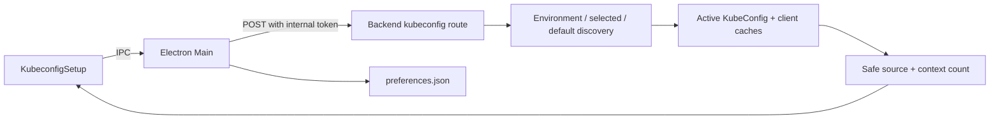

# Design - ops-union v1.5.0 kubeconfig selection controls

## Overview

The current desktop flow has two independent responsibilities:

1. Electron Main opens a native file picker, asks the local backend to validate the selected path, and persists `selectedKubeconfigPath` in the Electron user-data preferences file.
2. The backend resolves and caches the active kubeconfig using environment, selected, or platform-default discovery.

This specification keeps those ownership boundaries. The picker becomes extension-agnostic, and reset becomes an explicit authenticated control that returns the backend to normal discovery and removes the persisted override.

## Current ownership evidence

- Native picker, preference read/write, backend startup, and desktop IPC live in `desktop/src/main.ts`.
- The picker is exposed to the renderer through `desktop/src/preload.ts`.
- The renderer action and kubeconfig status panel live in `frontend/src/components/KubeconfigSetup.tsx` and `frontend/src/store.ts`.
- The backend discovery precedence lives in `backend/src/kube/kubeconfigDiscovery.ts`.
- Active config loading, reload, client caches, and safe status metadata live in `backend/src/kube/kubeconfig.ts`.
- The protected selection route lives in `backend/src/routes/kubeconfig.ts`.
- The selected path is passed to the backend as `OPS_FLOW_SELECTED_KUBECONFIG` by `desktop/src/backendProcess.ts`.

## Resolution contract

Normal discovery remains unchanged:

```text
KUBECONFIG configured and not ignored
    -> configured environment paths
otherwise selected path exists
    -> persisted/active selected file
otherwise
    -> platform default: %USERPROFILE%\\.kube\\config or $HOME/.kube/config
```

At startup, an explicitly selected path continues to override `KUBECONFIG`, as it does today. Reset removes that explicit selection, so the next resolution uses `KUBECONFIG` when present and the platform default otherwise.

## Component flow



## Picker design

`dialog.showOpenDialog` SHALL retain `properties: ['openFile']` and remove its `filters` option. This is the smallest change that removes the visible `Kubeconfig` dropdown while preserving the native dialog and existing selection flow.

The backend remains the authority for validity. A file can be selected regardless of extension, but it is persisted only after the existing `reloadKubeConfig(selectedPath)` succeeds. A cancelled dialog returns without changing active state or preferences.

## Reset design

### Control visibility

The renderer SHALL show a reset control in the desktop kubeconfig panel when `status.source === 'selected'`. This includes an unavailable selected file, allowing the user to recover from a stale path. The web build has no reset control because it has no native persisted desktop selection.

The control should use the existing icon-button style with a familiar reset/undo icon, accessible name, tooltip, and disabled state while loading. It should be adjacent to the existing file picker control rather than changing the panel layout or introducing a new modal.

### Backend route

Add a protected `POST /api/kubeconfig/reset` route beside `/api/kubeconfig/select`. It SHALL:

1. require the existing internal token;
2. call the existing reload path with `null`, so environment/default precedence is authoritative;
3. clear kubeconfig-derived caches only after the candidate configuration has loaded successfully;
4. return only `getKubeConfigStatus()` on success;
5. return the existing sanitized error shape on failure.

The route is intentionally separate from `/select`: an empty path must not be interpreted as a valid file selection.

The preferred failure policy is transactional. If environment/default discovery cannot load, the backend SHALL leave the selected active config and its caches untouched and return an error. Electron SHALL clear the persisted path only after the reset route succeeds. This prevents a failed reset from leaving the app with neither the old config nor a usable replacement.

### Desktop persistence and IPC

Add a desktop `resetKubeconfig` operation that:

1. calls the protected backend reset route;
2. removes only `selectedKubeconfigPath` from `preferences.json` after a successful backend response;
3. preserves theme and all preset data;
4. returns the safe status to the renderer;
5. reports a sanitized persistence error if preferences cannot be updated.

The preload bridge SHALL expose this operation beside `selectKubeconfig`. The desktop main process remains the only owner of filesystem preference access.

### Renderer state reset

The store SHALL share the existing successful kubeconfig-selection cleanup path with reset. After a successful reset, it SHALL:

- update kubeconfig status;
- clear contexts and context errors before reloading them;
- clear namespaces and namespace errors;
- clear targets and pod results;
- invalidate outstanding namespace/pod request generations;
- clear selected pod details and dependent query state;
- leave presets and theme unchanged.

The implementation SHALL avoid starting an implicit pod query. Context loading may be triggered by the existing target-selector lifecycle after the new status is accepted.

## Safety and compatibility

- No renderer filesystem access is added.
- The internal token remains required for reset and selection routes.
- Status responses continue to expose only availability, source, and context count.
- Backend errors continue to hide paths, YAML, tokens, certificates, and parser details.
- No Kubernetes API permissions or mutating operations are introduced.
- Existing selection behavior remains unchanged except for the new extension-agnostic picker and reset path.

## Test and evidence strategy

### Backend

Extend kubeconfig tests for:

- reset from a selected config to an environment config;
- reset from a selected config to the platform default;
- failed reset preserving the selected config and client cache;
- reset route authentication and sanitized errors;
- no change to environment/selected/default precedence.

### Desktop and renderer

There is currently no dedicated desktop test script and no focused `KubeconfigSetup` test. Add narrow tests only where the repository's current test setup supports them; otherwise use typecheck plus a manual Electron acceptance record. The manual check SHALL cover the native dialog, `.txt` selection, preference persistence, reset, restart, and stale-state clearing.

### Validation commands

```text
npm test --workspace=backend
npm run typecheck --workspace=backend
npm run typecheck --workspace=frontend
npm run typecheck --workspace=desktop
npm run build
```

Run `git diff --check` and inspect the final worktree. No commit, push, packaging, or Kubernetes mutation is part of this specification.
